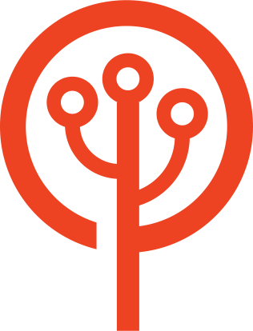

# 👋️ Bienvenue sur la page GitHub de Les-Tilleuls.coop !

Les-Tilleuls.coop est une ESN sous forme de [**Société coopérative et participative**](https://www.les-scop.coop/) spécialiste du e-commerce, des technologies du web et du logiciel libre.

Nous créons, contribuons et maintenons une multitude de logiciels libres comme :

* [🕷 API Platform](https://github.com/api-platform) : un framework web écrit en PHP et TypeScript permettant de créer des applications API-first
* [🎼 Symfony](https://github.com/symfony) : un ensemble de composants PHP et un framework pour les projets web
* [💌 Mercure](https://github.com/dunglas/mercure) : un protocole simplifiant le temps réel, avec une implémentation de référence écrite en Go
* [🔨 Vulcain](https://github.com/dunglas/vulcain) : un protocole permettant de créer des API REST orientées client, avec une implémentation de référence écrite en Go
* [⚡️ React ESI](https://github.com/dunglas/react-esi) : une bibliothèque de cache pour les applications React et Next.js, capable de créer des applications dynamiques aussi rapides que des sites statiques
* [🐲 FrankenPHP](https://github.com/dunglas/frankenphp): serveur PHP moderne écrit en Go
* [📚 PHP Standard Library](https://github.com/azjezz/psl) : un ensemble d’APIs pour les devs PHP
* [📄 Doctrine JSON ODM](https://github.com/dunglas/doctrine-json-odm) : un ODM pour l’ORM Doctrine
* [🛡️ OAuth2 Server Bundle](https://github.com/thephpleague/oauth2-server-bundle) : un bundle intégrant la bibliothèque oauth2-server dans les applications Symfony
* [🏄 ESQL](https://github.com/soyuka/esql) : une alternative au DQL
* [📦 Nos autres projets](https://github.com/orgs/coopTilleuls/repositories)
Vous trouverez ici toute notre documentation interne et autres informations utiles.

- [🌳️ Présentation de notre SCOP](scop/README.md)
- [🧙️ Les échelons de postes et notre grille de salaire](titles/README.md)
- [🚞️ Le guide d’onboarding](onboarding/README.md)
<!-- WIP :
- [📰️ Kit de press](press-kit/README.md)
- [🎨️ Styleguide](styleguide/README.md)
  -->

---

    
💡️ Inspiration

    Cette documentation est inspirée de plusieurs déjà existantes, telles que celles de:
    <ul>
    <li><a href="https://github.com/basecamp/handbook">Basecamp</a></li>
    <li><a href="https://github.com/24eme">24eme</a></li>
    <li><a href="https://www.loomio.coop/">Loomio</a></li>
    <li><a href="https://about.gitlab.com/handbook/">GitLab</a></li>
    </ul>

